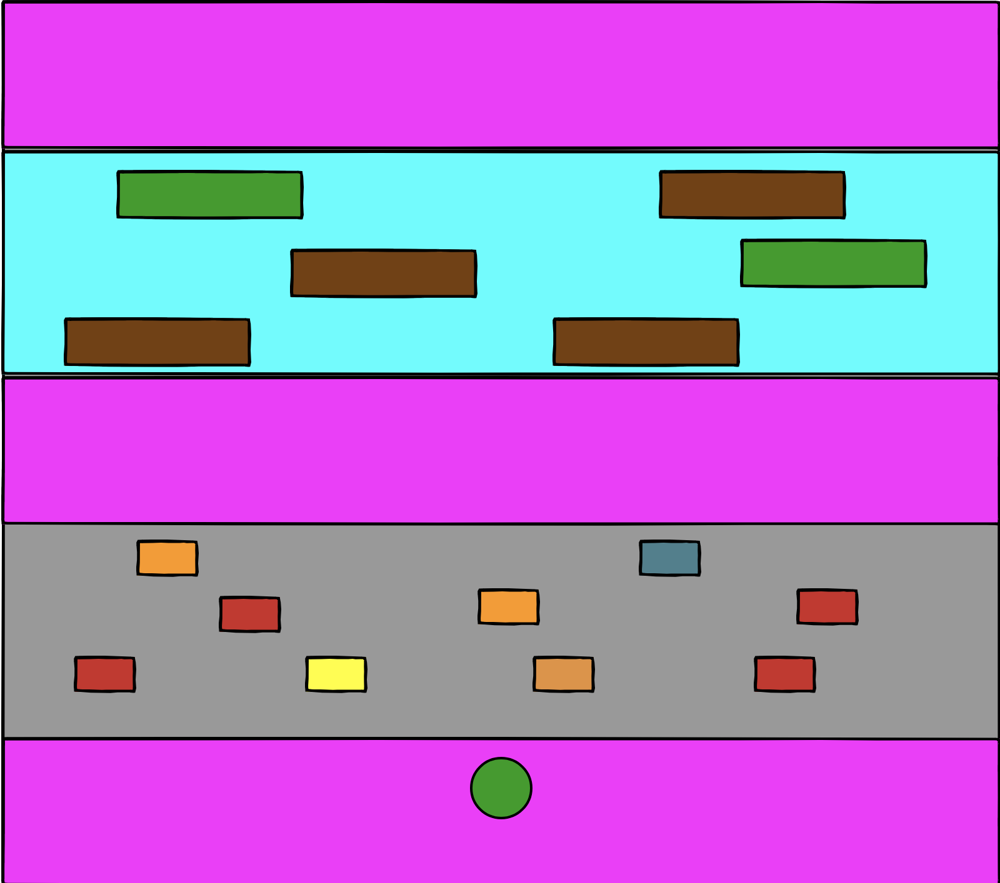
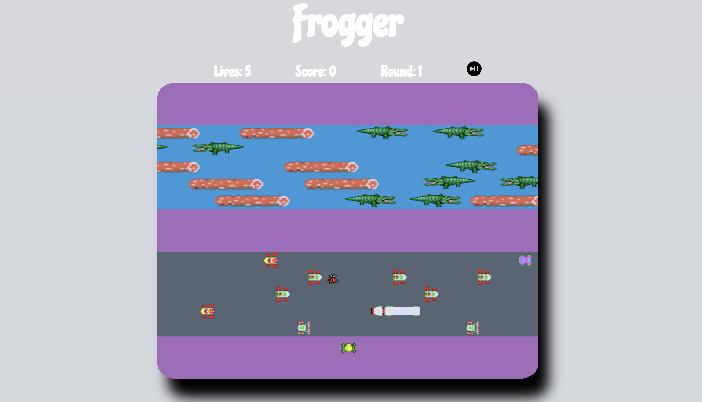

# Frogger
#### By Amjad Ali
### Credits
##### Courtesy for the Frogger Sprite Images Goes To The original Frogger Arcade Game Developed By Konami, Gremlin Industries, Parker Brothers, Hasbro Interactive, and Handheld Games.

##### Courtesy for the Crocodile Sprite Images Goes to https://dushaunwilliams.com/projects/project-miner/

##### Courtesy for the Lady Bug Sprite Images goes to https://gameartpartners.com/downloads/page/27/

### Instructions

* ##### Click the Play button to start the game.
* ##### Click the Pause button anytime to pause the game.
* ##### Using your Arrow Keys, Guide the Frog Across Heavy Traffic and Deadly Waters to The End of The Map While Avoiding Cars and Crocodiles.
* ##### Upon reaching the destination, a new round will start.
* ##### Cars, logs, and crocs move faster.
* ##### Points increment by 100 when reaching destination.
* ##### Points decrement by 100 if Frogger dies.
* ##### Eat the bug to earn 200 points.

### User Stories

* User should be able to move Frogger Northe, South, East, and West.
* User should be able to die when colliding with cars, crocs, or water.
* User should be able to sit on logs.
* User should be able to move left and right on log.
* User should be able to see lives, points and current round.

### Wire Frame

### Technology
##### This Game Was Developed With Javascript, Canvas, Classes, Factories, HTML, CSS, and Sprite Images.

### Description
##### This Game is Based on the Classic Frogger Game Developed In 1981.

### Game View

